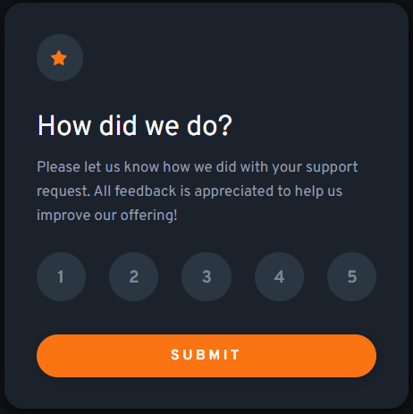
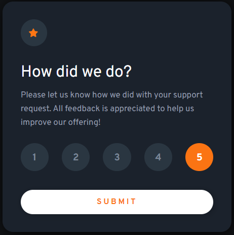

# Frontend Mentor - Interactive rating component solution

This is a solution to the [Interactive rating component challenge on Frontend Mentor](https://www.frontendmentor.io/challenges/interactive-rating-component-koxpeBUmI). Frontend Mentor challenges help you improve your coding skills by building realistic projects. 

## Table of contents

- [Overview](#overview)
  - [The challenge](#the-challenge)
  - [Screenshot](#screenshot)
  - [Links](#links)
- [My process](#my-process)
  - [Built with](#built-with)
  - [What I learned](#what-i-learned)
  - [Continued development](#continued-development)
  - [Useful resources](#useful-resources)
- [Author](#author)

## Overview

### The challenge

Users should be able to:

- View the optimal layout for the app depending on their device's screen size
- See hover states for all interactive elements on the page
- Select and submit a number rating
- See the "Thank you" card state after submitting a rating

### Screenshot

Desktop Layout



Thank you card


Hover states



Selected number state


### Links

- Solution URL: [Frontend Mentor](https://your-solution-url.com)
- Live Site URL: [Github Pages](https://timmartin13-frontend-mentor.github.io/interactive-rating-component/)

## My process

### Built with

- Semantic HTML5 markup
- CSS modules
- Flexbox
- Mobile-first workflow
- [React](https://reactjs.org/) - JS library


### What I learned

I learned that CSS modules are nice but styled components look cleaner throughout the code. Also, iterating through a loop was an interesting adventure in React. Creating an array and iterating through it seemed to be the best choice.

```js
const numrows = [1, 2, 3, 4, 5]; 

{numrows.map(item => (
          <Circle 
            value={ item } 
            key={ item }
            rating={ rating }
            setRating={ setRating }
          />
        ))}
```

### Continued development

I am definitely going to look into styled components for my next challenge, I like how organized it look in React.

### Useful resources

- [Hosting React on Github pages](https://www.c-sharpcorner.com/article/how-to-deploy-react-application-on-github-pages/) - This helped me to get my React app up on github pages
- [Separating CSS into modules](https://bootcamp.uxdesign.cc/using-css-modules-in-react-cc17f7c81247) - A walkthrough of how to separate your CSS into component based modules.


## Author

- Website - [My portfolio](https://timmartin13.github.io/react-portfolio/)
- Frontend Mentor - [@TimMartin13](https://www.frontendmentor.io/profile/TimMartin13)
